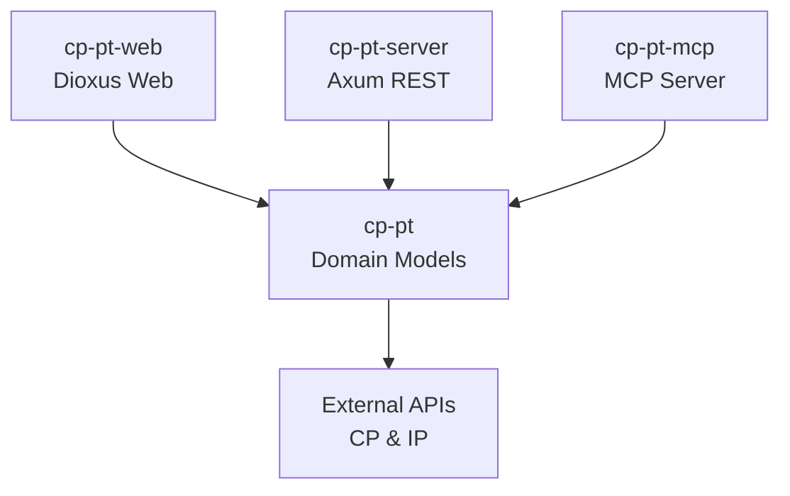

# CP-PT Rust

A Rust-based API and toolset for accessing Portuguese train (CP - Comboios de Portugal) information and schedules.

## Overview

This project was created to practice Rust programming skills and explore new concepts like the Model Context Protocol (MCP). It provides multiple ways to interact with Portuguese train data through different interfaces.

## Project Structure

```
cp-pt-rust/
├── cp-pt/     # Core library with domain models and HTTP client
├── cp-pt-server/      # REST API server with Axum
├── cp-pt-mcp/      # MCP (Model Context Protocol) server
├── cp-pt-web/   # Dioxus-based web frontend
└── target/         # Build artifacts
```

## Components

- **Core Library** - Shared functionality and domain models for train data
- **REST API** - HTTP endpoints for train information
- **MCP Server** - Model Context Protocol server for AI assistants
- **Web Viewer** - Interactive frontend application

## Features

- Station search by name
- Real-time timetables with departure/arrival information
- Detailed train information including routes and stops
- REST API for integration
- MCP server for AI assistant integration
- Web interface for browsing train data

## Quick Start

### Prerequisites

- Rust 1.75+ (uses edition 2024)
- Cargo

### Running Components

```bash
# Run the REST API server on http://127.0.0.1:3000
cargo run -p cp-pt-server

# Run the MCP server for AI assistant integration
cargo run -p cp-pt-mcp

# Run the web frontend
npm run build:css
dx serve
```

### Using as a Library

```toml
[dependencies]
cp-pt = { path = "path/to/cp-pt-rust/cp-pt" }
```

## Data Sources

This project integrates with official Portuguese transport APIs:

- CP (Comboios de Portugal) - https://www.cp.pt/sites/spring
- IP (Infraestruturas de Portugal) - https://www.infraestruturasdeportugal.pt

Note: These are unofficial API endpoints discovered through web inspection. They may change or become unavailable without notice.

## Development

```bash
# Build entire workspace
cargo build

# Run tests
cargo test

# Build for release
cargo build --release
```

## Architecture



## Author

Caio Silva - caio.cdcs@gmail.com
