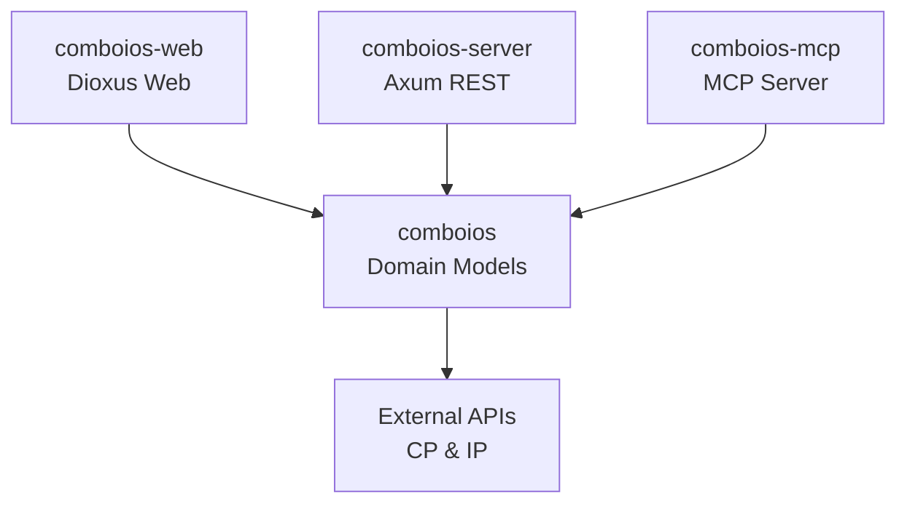

# Comboios-RS

A Rust-based API and toolset for accessing Portuguese train (CP - Comboios de Portugal) information and schedules.

## Overview

This project provides multiple ways to interact with Portuguese train data through different interfaces, featuring a clean and modern API design.

## Project Structure

```
comboios-rs/
├── comboios/          # Core library with domain models and HTTP client
├── comboios-server/   # REST API server with Axum
├── comboios-mcp/      # MCP (Model Context Protocol) server
├── comboios-web/      # Dioxus-based web frontend
└── target/            # Build artifacts
```

## Components

- **Core Library** - Shared functionality and domain models for train data
- **REST API** - HTTP endpoints for train information
- **MCP Server** - Model Context Protocol server for AI assistants
- **Web Viewer** - Interactive frontend application

## Features

- Station search by name
- Real-time timetables with departure/arrival information
- Detailed train information including routes and stops
- REST API for integration
- MCP server for AI assistant integration
- Web interface for browsing train data

## Quick Start

### Prerequisites

- Rust 1.75+ (uses edition 2024)
- Cargo

### Running Components

```bash
# Run the REST API server on http://127.0.0.1:3000
cargo run -p comboios-server

# Run the MCP server for AI assistant integration
cargo run -p comboios-mcp

# Run the web frontend
npm run build:css
dx serve
```

### Using as a Library

```toml
[dependencies]
comboios = { path = "path/to/comboios-rs/comboios" }
```

#### Basic Usage

```rust
use comboios::ComboiosApi;

#[tokio::main]
async fn main() -> Result<(), Box<dyn std::error::Error>> {
    // Create API client with default settings
    let api = ComboiosApi::new();
    
    // Search for stations
    let stations = api.get_stations("Lisboa").await?;
    println!("Found {} stations", stations.response.len());
    
    // Get timetable for a station
    if let Some(station) = stations.response.first() {
        let timetable = api.get_station_timetable(&station.code).await?;
        println!("Found {} trains", timetable.len());
        
        // Get details for a specific train
        if let Some(train_info) = timetable.first() {
            let train_details = api.get_train_details(train_info.train_number as u16).await?;
            println!("Train {} has {} stops", train_details.train_number, train_details.stops.len());
        }
    }
    
    Ok(())
}
```

#### Advanced Configuration

```rust
use comboios::ComboiosApi;
use reqwest::Client;
use std::time::Duration;

#[tokio::main]
async fn main() -> Result<(), Box<dyn std::error::Error>> {
    // Create custom HTTP client
    let client = Client::builder()
        .timeout(Duration::from_secs(30))
        .user_agent("MyApp/1.0")
        .build()?;
    
    // Create API with custom client and timeout
    let api = ComboiosApi::with_client(client)
        .with_timeout(Duration::from_secs(15));
    
    let stations = api.get_stations("Porto").await?;
    
    Ok(())
}
```

## API Design

The library uses a struct-based API design with the `ComboiosApi` client:

- **Simple Creation**: `ComboiosApi::new()` - Uses default settings
- **Custom Client**: `ComboiosApi::with_client(client)` - Bring your own reqwest client
- **Configurable**: `ComboiosApi::with_timeout(duration)` - Set request timeouts
- **Builder Pattern**: Chain methods for easy configuration
- **Connection Reuse**: Efficient HTTP connection pooling
- **Testable**: Easy dependency injection for testing

## Data Sources

This project integrates with official Portuguese transport APIs:

- CP (Comboios de Portugal) - https://www.cp.pt/sites/spring
- IP (Infraestruturas de Portugal) - https://www.infraestruturasdeportugal.pt

Note: These are unofficial API endpoints discovered through web inspection. They may change or become unavailable without notice.

## Development

```bash
# Build entire workspace
cargo build

# Run tests
cargo test

# Build for release
cargo build --release
```

## Architecture




## Author

Caio Silva - caio.cdcs@gmail.com
