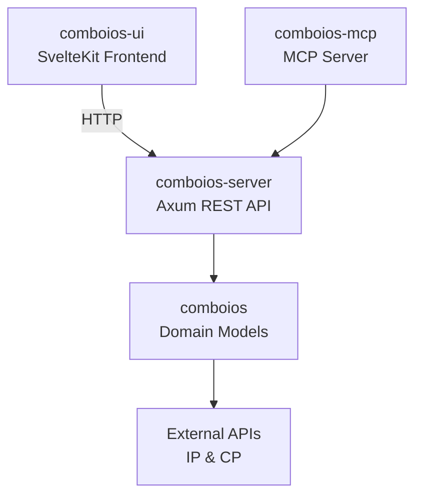

# Comboios-RS

A Rust-based API and toolset for accessing Portuguese train (CP - Comboios de Portugal) information and schedules.

## Overview

This project provides multiple ways to interact with Portuguese train data through different interfaces, featuring a clean and modern API design.

## Project Structure

```
comboios-rs/
├── comboios/          # Core library with domain models and HTTP client
├── comboios-server/   # REST API server with Axum
├── comboios-mcp/      # MCP (Model Context Protocol) server
└── comboios-ui/       # SvelteKit-based web frontend (TypeScript)
```

## Components

- **Core Library** - Shared functionality and domain models for train data
- **REST API** - HTTP endpoints for train information (runs on localhost:3000)
- **MCP Server** - Model Context Protocol server for AI assistants
- **Web UI** - SvelteKit-based interactive frontend

## Architecture


```mermaid
graph TD
    A[comboios-ui<br/>SvelteKit Frontend] -->|HTTP| B[comboios-server<br/>Axum REST API]
    C[comboios-mcp<br/>MCP Server] --> B
    B --> D[comboios<br/>Domain Models]
    D --> E[External APIs<br/>IP & CP]
```

## Features

- Station search by name
- Real-time timetables with departure/arrival information
- Train delay information
- REST API for integration
- MCP server for AI assistant integration
- Modern web UI (SvelteKit)

## Quick Start

### Prerequisites

- Rust 1.75+ (uses edition 2024)
- Cargo
- Node.js 18+ (for frontend)

### Running the REST API Server

```bash
# Start the backend server on http://localhost:3000
cargo run -p comboios-server
```

The server provides these endpoints:
- `GET /stations?query={name}` - Search stations
- `GET /stations/timetable/{id}` - Get station board
- `GET /trains/{id}` - Deprecated

### Running the MCP Server

```bash
# Run the MCP server for AI assistant integration
cargo run -p comboios-mcp
```

### Running the Web UI (SvelteKit)

```bash
cd comboios-ui
bun install
bun run dev        # Development server on http://localhost:5173
bun run build      # Production build to dist/
```

To deploy:
```bash
bun run build
rsync -avz dist/ your-server:/var/www/comboios/
```

## Using as a Library

```toml
[dependencies]
comboios = { path = "path/to/comboios-rs/comboios" }
```

### Basic Usage

```rust
use comboios::ComboiosApi;

#[tokio::main]
async fn main() -> Result<(), Box<dyn std::error::Error>> {
    // Create API client with default settings
    let api = ComboiosApi::new();

    // Search for stations
    let stations = api.get_stations("Lisboa").await?;
    println!("Found {} stations", stations.response.len());

    // Get timetable for a station
    if let Some(station) = stations.response.first() {
        let boards = api.get_station_board_now(&station.code).await?;
        println!("Found {} boards", boards.len());
        
        for board in boards {
            println!("Station: {}", board.station_name);
            for train in board.trains {
                println!("  Train {} to {}", 
                    train.train_number, 
                    train.destination_station_name
                );
            }
        }
    }

    Ok(())
}
```

### Advanced Configuration

```rust
use comboios::ComboiosApi;
use reqwest::Client;
use std::time::Duration;

#[tokio::main]
async fn main() -> Result<(), Box<dyn std::error::Error>> {
    // Create custom HTTP client
    let client = Client::builder()
        .timeout(Duration::from_secs(30))
        .user_agent("MyApp/1.0")
        .build()?;

    // Create API with custom client
    let api = ComboiosApi::with_client(client);

    let stations = api.get_stations("Porto").await?;

    Ok(())
}
```

## API Design

The library uses a struct-based API design with the `ComboiosApi` client:

- **Simple Creation**: `ComboiosApi::new()` - Uses default settings
- **Custom Client**: `ComboiosApi::with_client(client)` - Bring your own reqwest client
- **Builder Pattern**: Chain methods for easy configuration
- **Connection Reuse**: Efficient HTTP connection pooling

## Data Sources

This project integrates with official Portuguese transport APIs:

- IP (Infraestruturas de Portugal) - Real-time station boards
- CP (Comboios de Portugal) - Station search

Note: These are unofficial API endpoints discovered through web inspection. They may change or become unavailable without notice.

## API Changes

### v0.2.0 Migration Notes

The project migrated from the old CP API to the new Infraestruturas de Portugal (IP) API:

**Breaking Changes:**
- `get_station_timetable(station_id)` → `get_station_board_now(station_id)`
- Returns `Vec<StationBoard>` instead of `Vec<Timetable>`
- `get_train_details()` is deprecated and no longer available
- New types: `StationBoard`, `TrainEntry` with delay parsing

See [MIGRATION.md](MIGRATION.md) for detailed migration guide.

## Development

```bash
# Build entire workspace
cargo build

# Run tests
cargo test

# Build for release
cargo build --release

# Run clippy
cargo clippy
```

## Author

Caio Silva - caio.cdcs@gmail.com

## Contributing

See [CONTRIBUTING.md](CONTRIBUTING.md) for contribution guidelines.
